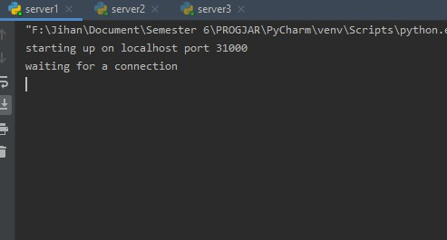
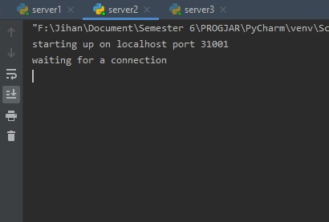
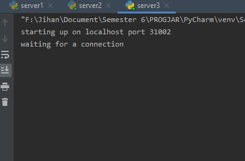
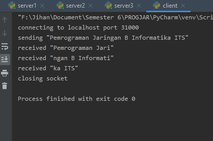
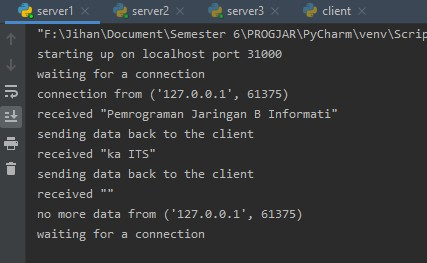
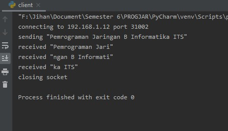
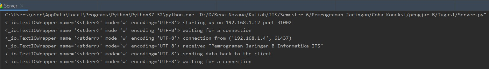

# Tugas 1 - Mengirimkan pesan

## Menjalankan Server dengan port yang berbeda (31000, 31001, 31002) pada local, dan client mengirimkan pesan

Kondisi awal server dengan port 3100,3101,3102 menyala

Lalu client mengirimkan pesan ke server dengan 3 port tersebut, berikut ini contoh client mengirim pesan ke port 31000

## Client mengirimkan pesan ke komputer yang berbeda
Mengirimkan pesan komputer yang berbeda, yaitu 192.168.1.12

