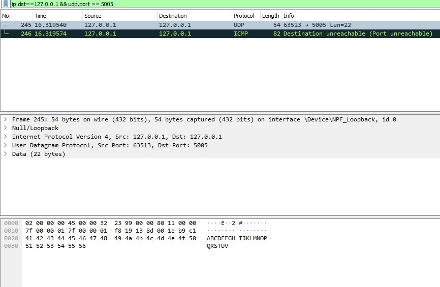
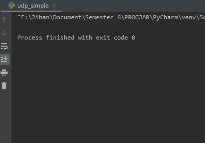
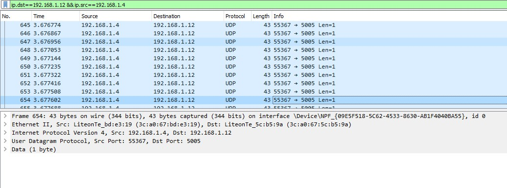
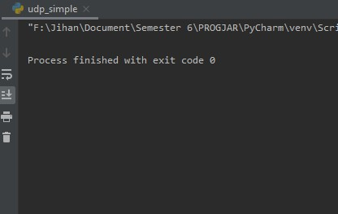
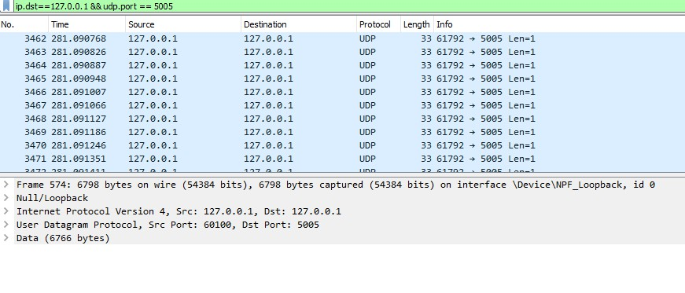
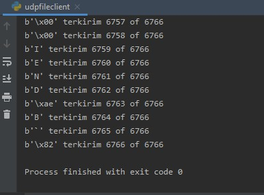
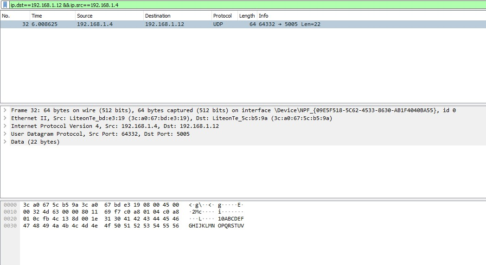
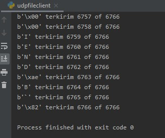

# Tugas 2

## Menjalankan udp_simple dari pc saya(ip=127.0.0.1) ke localhost (127.0.0.1) dengan port 5005.

## Menjalankan udp_simple dari pc saya(ip=192.168.1.4) ke pc lain (ip=192.168.1.12).

## Menjalankan udp_fileclient dari pc saya(ip=127.0.0.1) ke localhost (127.0.0.1) dengan port 5005.

## Menjalankan udp_fileclient dari pc saya(ip=192.168.1.4) ke pc lain (ip=192.168.1.12).

