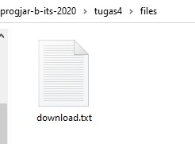
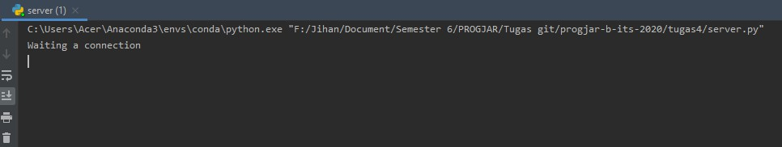
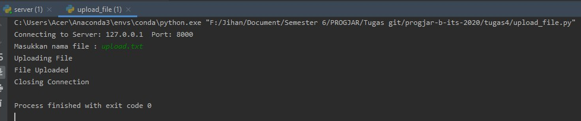
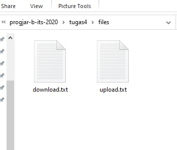
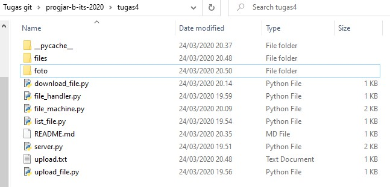
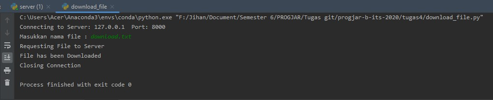
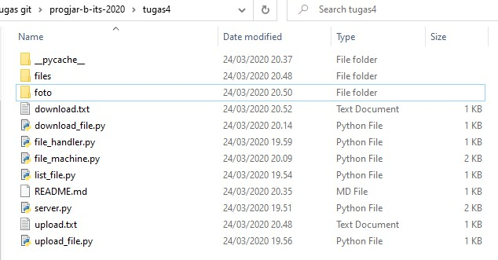
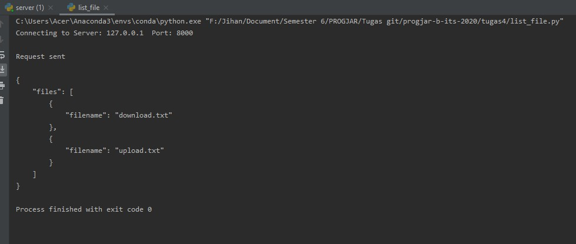

# Tugas 4
## Dokumentasi Protokol
### Ketentuan Membaca Format
String terbagi menjadi 2 bagian, yang dipisahkan oleh spasi. Dengan format

`command [spasi] parameter [spasi] parameter`

### Daftar Fitur
Fitur yang ada yaitu:
1. Meletakkan File
    - Request : `upload_file`
    - Parameter : `namafile [spasi] isi dari file`
    - Response : 
        - Berhasil -> `File Uploaded`
        - Gagal -> `Failed`

2. Mengambil File
    - Request : `download_file`
    - Parameter : `namafile`
    - Response : file telah terdownload di folder yang sama dengan script

3. Melihat List File
    - Request : `list_file`
    - Parameter : -
    - Response : list file yang ada pada folder `files`
4. Apabila `command` tidak dikenali, maka akan merespon `Command Error`

**Folder untuk menyimpan file yaitu folder _files_**

## Laporan
1. Protokol **meletakkan file**
    - Kondisi awal folder files
    
    
    - Menyalakan `server.py` dan `upload_file.py`. File yang ingin diupload adalah _upload.txt_
    
    
    - Berhasil diletakkan dalam folder files

    
2. Protokol **mengambil file**
    - Kondisi awal folder

    
    - Menyalakan `server.py` dan `download_file.py`. File yang ingin didapatkan yaitu _download.txt_
    
    
    - File berhasil didapatkan

    
3. Protokol **melihat list file**
    - File yang terdapat pada folder files sekarang

    
    - Menyalakan `server.py` dan `list_file.py`
    
    

